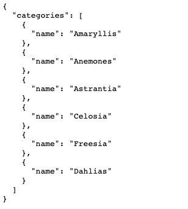
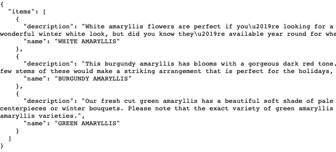
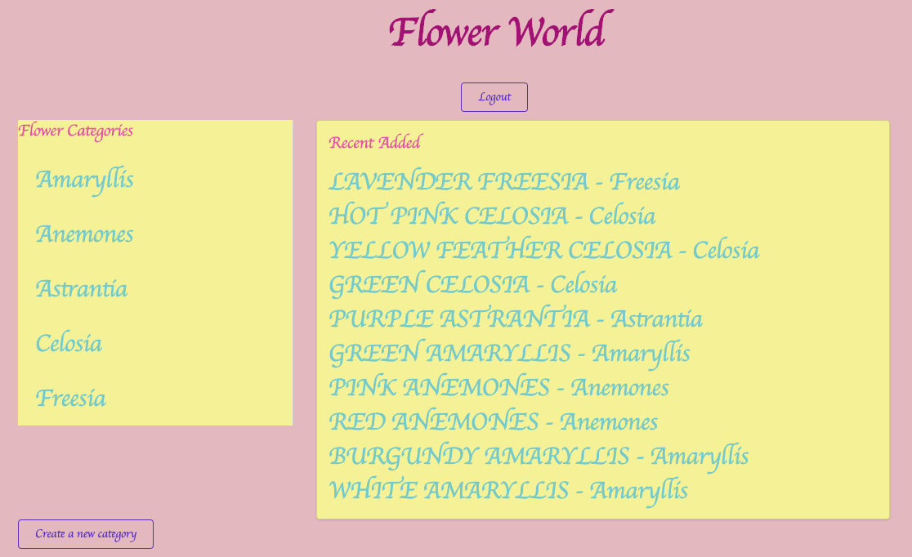
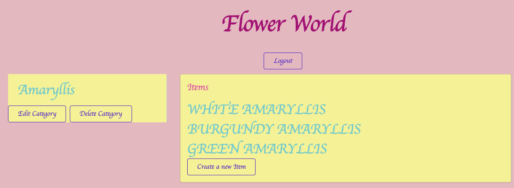
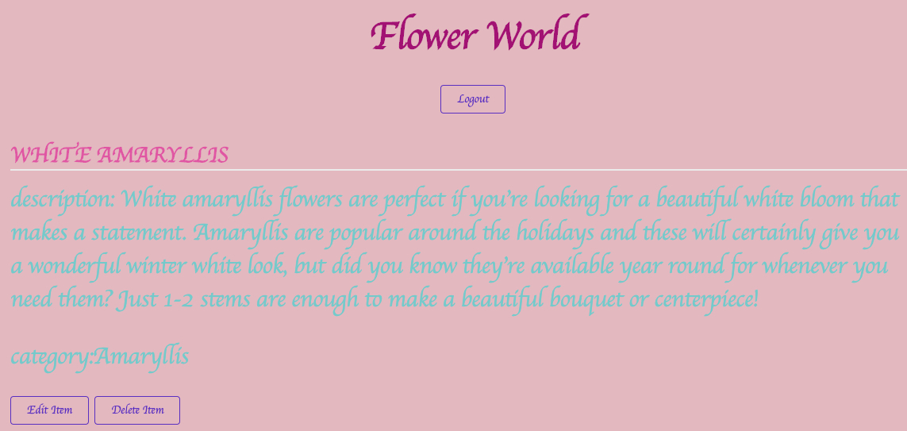
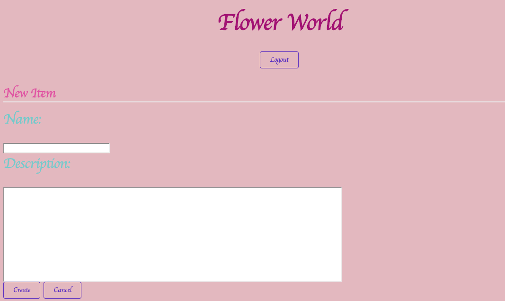

# Item-Catalog
This an application that provides a list of flowers within a variety of categories as well as provide a user registration and authentication system. Registered users will have the ability to post, edit and delete their own flowers.


## Configuration
### To make it run, you need these application:
* Python 2.7
* Vagrant
* VirtualBox
* [VM configuration](https://d17h27t6h515a5.cloudfront.net/topher/2017/August/59822701_fsnd-virtual-machine/fsnd-virtual-machine.zip)

### On you terminal, cd into your vagrant folder and type commands below :
```
$ vagrant up 
```
$ vagrant ssh
```
$ sudo pip install -r requirements
```
$ Python database_setup.py
```
$ Python project.py
```

### In your browser, go to http://localhost:5000

## JSON Endpoints

`/categories/JSON` 



`/categories/<int:chosen_category_id>/items/JSON`




## REST Endpoints

`/` or `/categories`



`/categories/<int:chosen_category_id>` or `/categories/<int:chosen_category_id>/items`



`/categories/<int:chosen_category_id>/items/<int:chosen_item_id>`



`/categories/<int:this_category_id>/items/add/`



`/categories/<int:category_id>/delete/`


`/categories/<int:category_id>/items/<int:item_id>/delete`


`/categories/<int:chosen_category_id>/edit/`


### Credits
The flower information come from Flower Muse